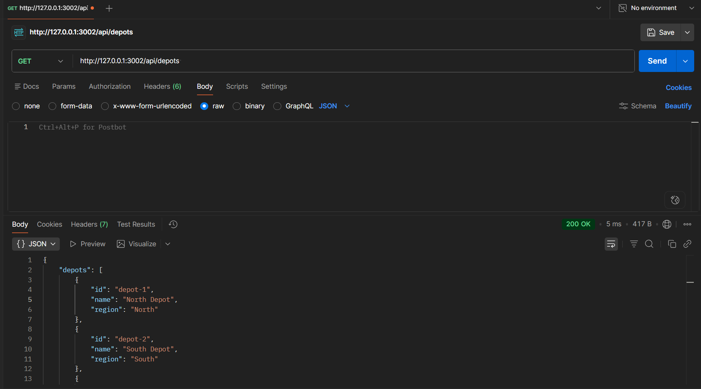
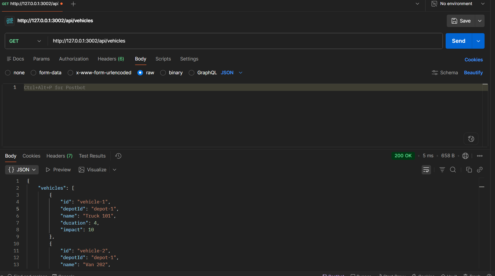
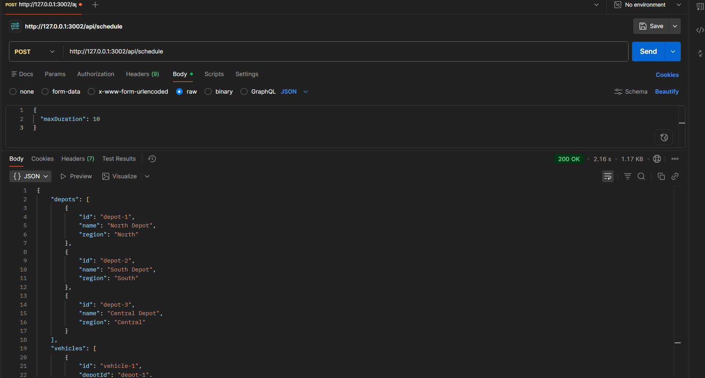

# Backend Evaluation Assignment

## Introduction

This project is a Node.js backend assignment built as a small multi-service system. It includes a logging middleware service, a vehicle maintenance scheduler that uses optimization to select vehicles efficiently, and a notification backend. The services are organized to demonstrate modular backend design, external API integration, and clean separation of responsibilities.

## Tech Stack

- Node.js
- Express.js
- Axios
- JavaScript

## Features

- Custom logging middleware with external API integration
- Authentication using client credentials and Bearer token flow
- Vehicle maintenance scheduler using the 0/1 Knapsack algorithm
- Backend APIs wrapped through local Express services
- Response time tracking in API testing and submission screenshots
- Clean modular architecture with separate controllers, services, routes, and models

## Project Structure

```text
RA2311003020532/
├── logging-middleware/
├── vehicle_maintenance_scheduler/
├── notification_app_be/
├── screenshots/
│   ├── logging-middleware/
│   ├── vehicle-scheduler/
│   └── notification/
├── SCREENSHOT_EXPLANATION.md
└── notification_system_design.md
```

## API Endpoints

### GET /api/depots

Returns the list of depots used by the scheduler.

Sample response:

```json
{
  "depots": [
    {
      "id": "depot-1",
      "name": "North Depot",
      "region": "North"
    },
    {
      "id": "depot-2",
      "name": "South Depot",
      "region": "South"
    }
  ]
}
```

### GET /api/vehicles

Returns the list of vehicles used by the optimization logic.

Sample response:

```json
{
  "vehicles": [
    {
      "id": "vehicle-1",
      "depotId": "depot-1",
      "name": "Truck 101",
      "duration": 4,
      "impact": 10
    },
    {
      "id": "vehicle-3",
      "depotId": "depot-2",
      "name": "Bus 303",
      "duration": 6,
      "impact": 12
    }
  ]
}
```

### POST /api/schedule

Generates the best maintenance plan for the given maximum duration using the 0/1 Knapsack algorithm.

Request body:

```json
{
  "maxDuration": 10
}
```

Sample response:

```json
{
  "depots": [
    {
      "id": "depot-1",
      "name": "North Depot",
      "region": "North"
    }
  ],
  "vehicles": [
    {
      "id": "vehicle-1",
      "depotId": "depot-1",
      "name": "Truck 101",
      "duration": 4,
      "impact": 10
    },
    {
      "id": "vehicle-3",
      "depotId": "depot-2",
      "name": "Bus 303",
      "duration": 6,
      "impact": 12
    }
  ],
  "maxDuration": 10,
  "totalDuration": 10,
  "totalImpact": 22,
  "selectedVehicles": [
    {
      "id": "vehicle-1",
      "depotId": "depot-1",
      "name": "Truck 101",
      "duration": 4,
      "impact": 10,
      "depot": {
        "id": "depot-1",
        "name": "North Depot",
        "region": "North"
      }
    },
    {
      "id": "vehicle-3",
      "depotId": "depot-2",
      "name": "Bus 303",
      "duration": 6,
      "impact": 12,
      "depot": {
        "id": "depot-2",
        "name": "South Depot",
        "region": "South"
      }
    }
  ]
}
```

## Screenshots

### Vehicle Scheduler: Depots



This screenshot shows the `GET /api/depots` request, the returned JSON response, and the response time. It confirms that the scheduler can expose depot data through the local backend API.

### Vehicle Scheduler: Vehicles



This screenshot shows the `GET /api/vehicles` request, the returned JSON response, and the response time. It confirms that the scheduler can expose vehicle data needed by the optimization routine.

### Vehicle Scheduler: Schedule Result



This screenshot shows the schedule generation request, the computed response, and the response time. It demonstrates the 0/1 Knapsack-based selection logic used by the scheduler.

## Setup Instructions

```bash
git clone <repository-url>
cd RA2311003020532
npm install
node index.js
```

Run each service from its own folder:

```bash
cd logging-middleware
node index.js

cd vehicle_maintenance_scheduler
node index.js

cd notification_app_be
node index.js
```

## Important Notes

- The APIs are wrapped by local backend services and are not called directly from the client.
- Logging middleware is used across all modules for structured log integration.
- Response time is included in the API testing screenshots and should be captured during submission.
- The scheduler uses local endpoints for clean testing, with optional upstream integration handled inside the service layer.

## Conclusion

This solution is scalable, modular, and aligned with backend best practices. It separates concerns cleanly, keeps the API surface consistent, and demonstrates practical service integration with authentication, logging, and optimization logic.
